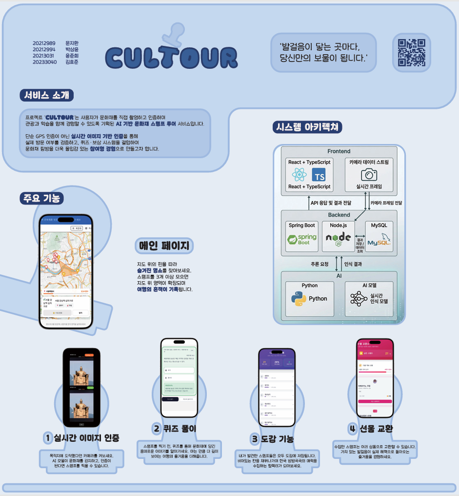
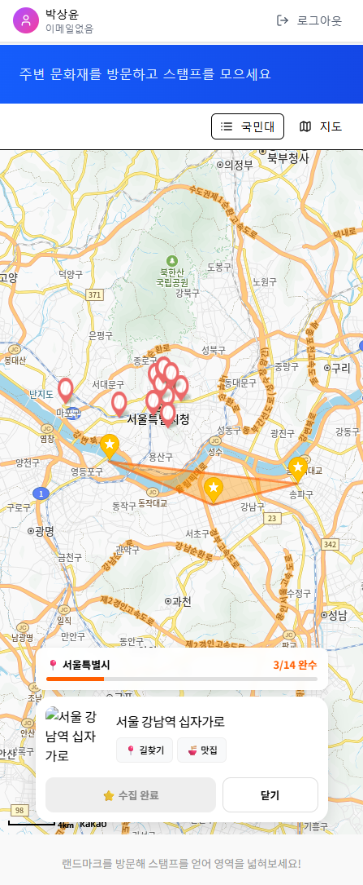
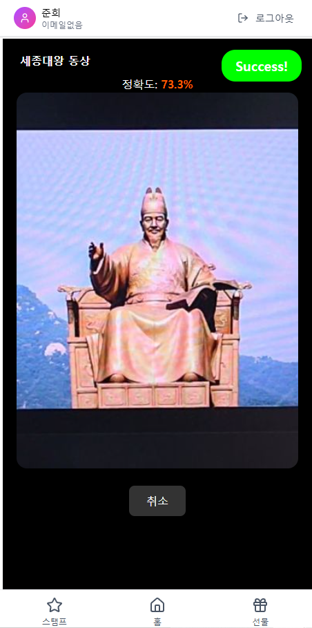
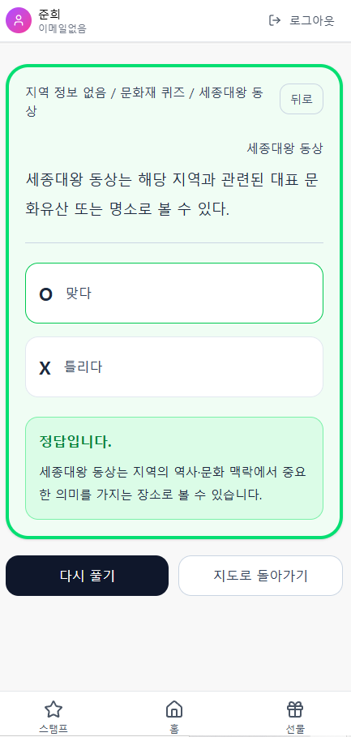
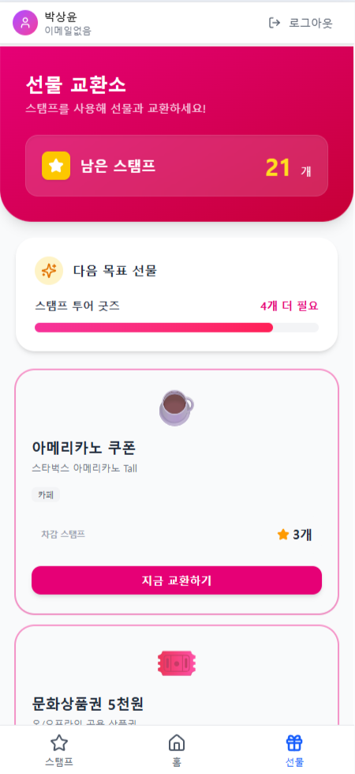
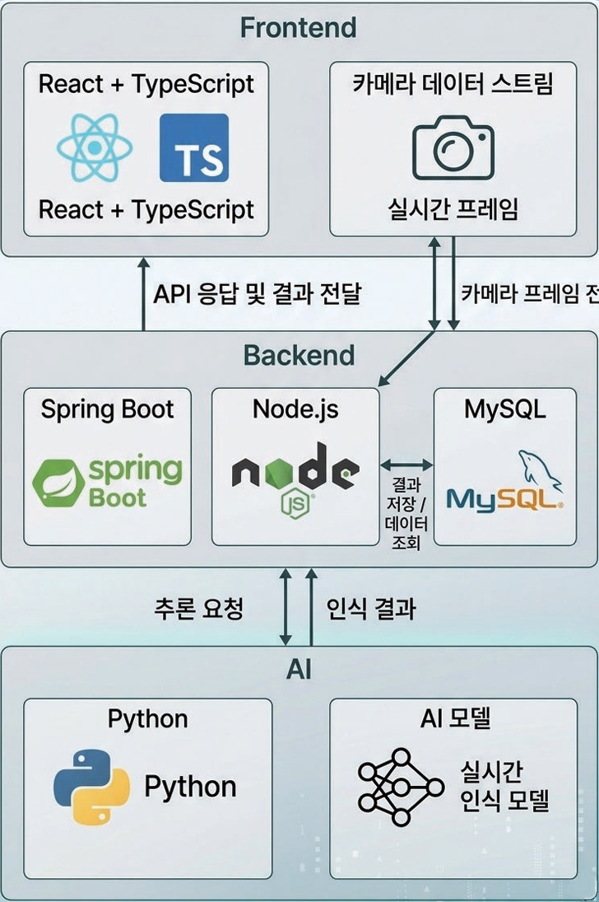

  <h1>🗺️ Cultour (관광지 스탬프 투어)</h1>
  
<strong>주변 문화재를 방문하고, 스탬프를 모으며 즐기는 역사 탐방 웹 서비스</strong>

  
  
    

## 프로젝트 소개

> **"지루한 문화재 방문을 하나의 게임처럼 즐겁게!"**

**Cultour**는 온·오프라인을 융합하여 사용자에게 새로운 역사 탐험 경험을 제공합니다. 
사용자는 지도를 통해 주변 문화재를 확인하고, **실시간 웹캠을 통한 방문 인증(AI 객체 인식)**과 **역사 퀴즈**를 통해 자신만의 스탬프 컬렉션을 완성할 수 있습니다. 모은 스탬프는 교환소에서 다양한 리워드로 교환하며 성취감을 얻을 수 있습니다.

 

## 프로젝트 포스터

  

 

## 시연 영상 및 발표 자료

  <h3>🎥 시연 영상 (YouTube)</h3>
  

  <h3>📊 발표 자료 (PPT)</h3>
  

 

## 주요 기능

| 위치 기반 인터랙티브 지도 | AI 실시간 카메라 인증 |
|:---:|:---:|
|  |  |
| **카카오 맵 API**를 활용하여 내 주변 문화재와 획득 가능한 스탬프의 위치를 직관적으로 보여줍니다. | 랜드마크 앞에서 카메라를 켜면 **AI 객체 인식**을 통해 실제 방문 여부를 실시간으로 인증합니다. |

| 역사 퀴즈 시스템 | 리워드 교환소 |
|:---:|:---:|
|  |  |
| 인증을 마치면 해당 문화재와 관련된 **O/X 퀴즈**가 출제되어 역사적 지식을 자연스럽게 습득합니다. | 지역별 수집률을 한눈에 확인하고, 모은 스탬프로 상품권, 굿즈 등 **실제 리워드로 교환**합니다. |

 

## 시스템 아키텍처

  

* **Client:** React (TypeScript) 기반의 반응형 PWA 구축
* **Server:** Spring Boot 기반 RESTful API 및 JWT + OAuth2 보안 설계
* **AI/WebSocket:** Python 서버를 통한 실시간 이미지 프레임 객체 인식 처리
* **Database & Infra:** MySQL, AWS Lightsail을 이용한 무중단 배포 환경

 

## 기술 스택

### Frontend

  
  
  

### Backend

  
  
  
  

### Infra & Tools

  
  
  

 

## 팀원 소개

| 프로필 사진 | 이름(학번) | 역할 및 담당 업무 | GitHub |
| :---: | :---: | :--- | :---: |
|  | **문지환** | **Team Leader & Frontend**   - 기획 및 프로젝트 총괄   - React 기반 UI/UX 설계 및 개발   - 맵 지도 연동 및 스탬프 비즈니스 로직 구현 | [@munjihwan020627](https://github.com/munjihwan020627) |
|  | **김효준** | **AI**   - 실시간 웹캠 비디오 프레임 전송 로직 구현   - 랜드마크 객체 인식 AI 모델 학습 및 최적화 | [@SoftwareJun](https://github.com/SoftwareJun) |
|  | **박상윤** | **Backend**   - Spring Boot 백엔드 API 설계 및 개발   - JWT 및 OAuth2 기반 보안 아키텍처 구현   - DB 설계 및 구축 | [@Park-Sangyun](https://github.com/Park-Sangyun) |
|  | **윤준희** | **Backend**   - Spring Boot 백엔드 API 설계 및 개발   - 맵 지도 연동 및 스탬프 비즈니스 로직 구현   - Python WebSocket 통신 서버 구축 | [@yjunhee](https://github.com/yjunhee) |